# A 20-Year Retrospective of Healthcare Development in China

## Group member

Yixin Xia

Manxi Tao

Jiahao Xiao

Mengxuan Yan

Danyang Li

Junya Yang

## Data Description
We found a total of 3 different datasets, each of which included data from China over the last 20 years
This is followed by the descriptive statistics of the three datasets

### Under-five and maternal mortality rates between 2003 and 2023
Next, I will use the line chart to make a certain analysis of the regional mortality rate of children under 5 years old and maternal mortality, and use this to prove that China has made great progress between 2003 and 2022.

#### Neonatal mortality rate

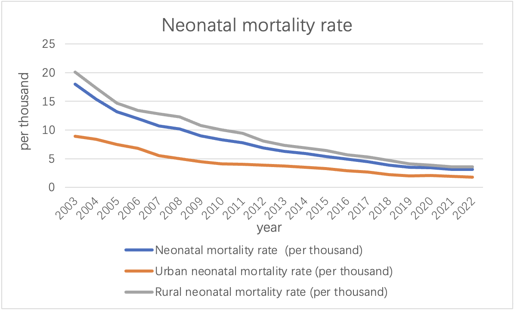
As can be seen from the above picture, between the years 2003 and 2022, China has witnessed a noteworthy decline in its neonatal mortality rate, reducing from 18‰ to 3.1‰. All the data are generally showed a downward trend. This substantial improvement underscores the advancements made in healthcare and targeted interventions for newborn health. This decline can be attributed to a multitude of factors including enhanced healthcare facility accessibility, advancements in medical technology, heightened awareness of maternal and child health, and the implementation of government policies and programs aimed at reducing neonatal mortality. These aggregated efforts have contributed significantly to the observed downward trend in neonatal mortality rates in China over the given period.

#### Infant mortality rate
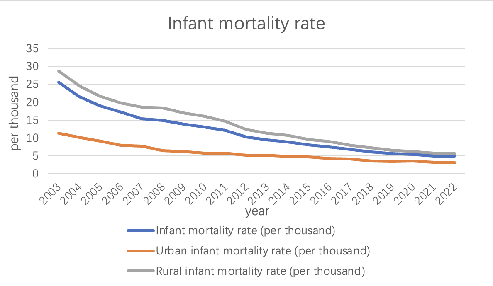
China has made significant progress in reducing the overall infant mortality rate, which includes deaths during the first year of life.
Among them, the data generally showed a downward trend. From 2003 to 2022, the infant mortality rate declined from 25.5‰ to 4.9‰. Government investments in healthcare infrastructure, prenatal care, vaccination programs, and disease prevention have contributed to this decline.
#### Under-five mortality rate
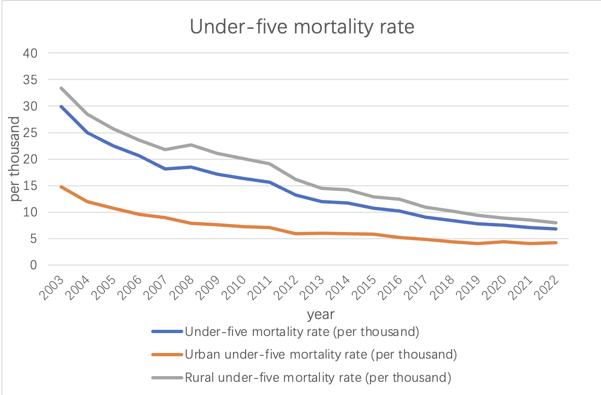
The under-five mortality rate is another essential indicator of child health. It tracks the probability of a child dying before reaching the age of five.
China has shown remarkable progress in reducing under-five mortality.
Among them, the data generally showed a downward trend. From 2003 to 2022, the under-five mortality rate plummeted from 33.4‰ to 6.8‰, reflecting significant improvements in child healthcare and disease prevention.
#### Maternal mortality rate
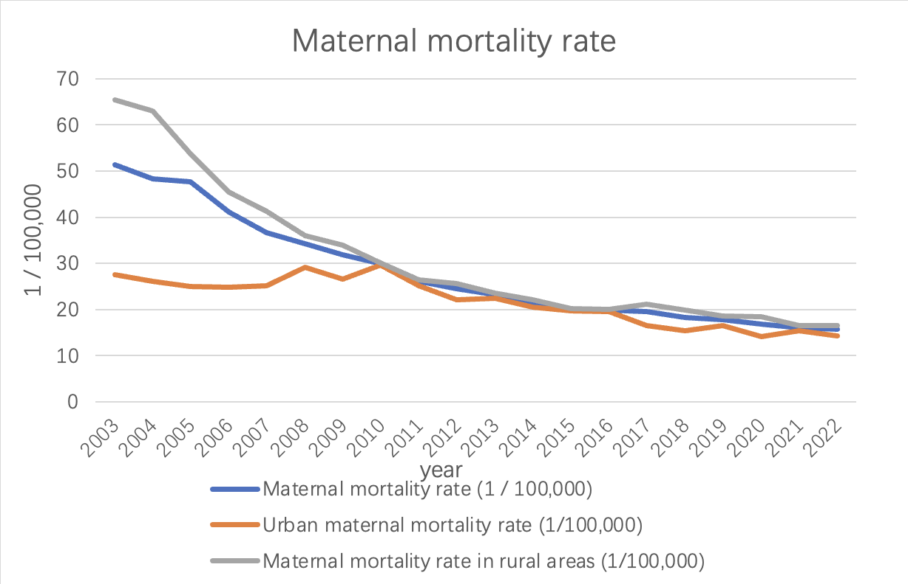
As can be seen from the line chart above, China's maternal mortality rate has decreased. The rate dropped from 51.3 per 100,000 in 2003 to 15.7 per 100,000 in 2022. This reflects the remarkable progress China has made in maternal health. The maternal mortality rate fluctuates from year to year. From 2003 to 2010, the mortality rate showed a yearly decline. However, starting in 2010, mortality rates changed more slowly, with small fluctuations between 2014 and 2016. Since 2016, the maternal mortality rate has stabilized and remained at a low level. This shows that China has successfully reduced the maternal mortality rate in recent years, and has achieved remarkable results.

#### Urban and rural neonatal mortality rates
Throughout the years, urban areas consistently exhibited lower neonatal mortality rates compared to rural areas. The urban-rural gap in neonatal mortality rates has gradually reduced, indicating that efforts have been made to improve healthcare accessibility and quality in rural regions.
Government initiatives, including the Healthy China 2030 campaign, have aimed to bridge this gap by providing better healthcare services and infrastructure in rural areas.

From the above we can conclude:

- Healthcare infrastructure: China has invested heavily in healthcare infrastructure, particularly in rural areas. This has led to improved access to medical facilities, including maternal and child healthcare services.

- Health policies and programs: The Chinese government has implemented various policies and programs focused on maternal and child health, such as the New Rural Cooperative Medical Scheme, the “Two Children Policy,” and the Healthy China 2030 campaign. These initiatives have prioritized healthcare improvement and played a role in reducing mortality rates.

- Improved healthcare quality and workforce: China has made efforts to enhance the quality of healthcare services and the skills of healthcare professionals. This includes initiatives to train doctors, nurses, and midwives, as well as the introduction of standardized protocols for maternal and child healthcare.

- Enhanced disease prevention and vaccination programs: China has implemented robust disease prevention strategies, including comprehensive vaccination programs, which have significantly contributed to reducing infant and child mortality rates.

It’s important to note that this analysis is based on the data provided and does not capture all the complexities of China’s healthcare system. Factors such as socioeconomic disparities, regional variations, and changes in healthcare policies over time should also be considered for a comprehensive understanding of China’s healthcare development.

### Health technicians per 10,000 population between 2003 and 2023
We counted the number of health technicians per 10,000 people from 2003 to 2022 and found that the data had the following characteristics:
| Variable Name                                    | Average Value | Standard Deviation | Median | Variance  |
|--------------------------------------------------|---------------|--------------------|--------|-----------|
| Number of health technicians per 10,000 people   | 53.55         | 16.22              | 51     | 263.103   |
| Number of urban health technicians per 10,000 people | 85.05         | 21.683             | 88.5   | 470.155   |
| Number of rural health technicians per 10,000 people | 37.65         | 12.546             | 35     | 157.397   |

The national average number of health technicians per 10,000 people is shown in the following chart:
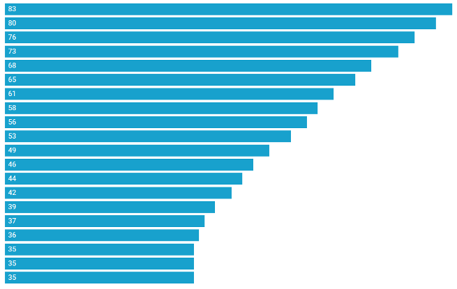

- Trend change: Data shows that the number of health technicians has increased year by year, from 35 in 2003 to 83 in 2022.
- Mean and Quantile Values: The mean value is 51.000  and the median value is 51.000, indicating that the central trend of the data is relatively stable.
- Explanation of differences: The large standard deviation and high dispersion of the overall number of health technicians reflect differences in health system management and resource allocation in different regions. Attention needs to be paid to the balanced allocation and management efficiency of health resources to ensure that all districts have access to appropriate health services and resource support。

The average number of health technicians per 10,000 people in cities across the country is shown in the following chart:
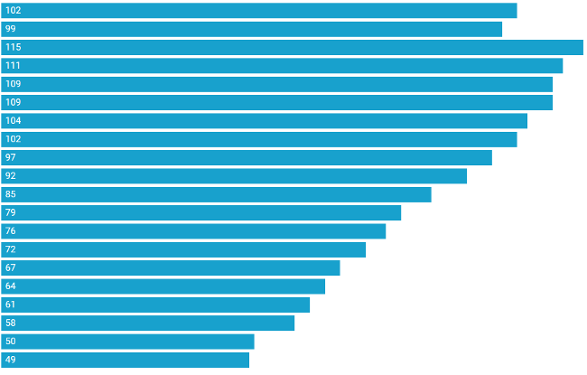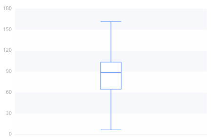

|           | 25% quantile | Median | 75% quantile | Maximum | Minimum |
|-----------|--------------|--------|--------------|---------|---------|
| Value     | 64.750       | 88.500 | 103.500      | 115.000 | 49.000  |

- Trend change: Data shows that the number of urban health technicians has increased year by year, from 49 in 2003 to 115 in 2022.
Volatility: There are large differences in the number of health technicians in cities, indicating that some city residents spend more on health and others lower.
- Mean and quantile: The mean value was 88.500  and the median was 88.500, indicating that the number of urban health technicians was on the rise overall, but the difference was large.

The average number of health technicians per 10,000 people in cities across the country is shown in the following chart:
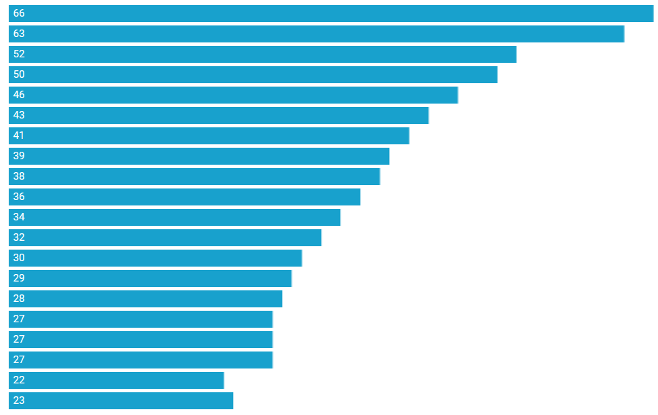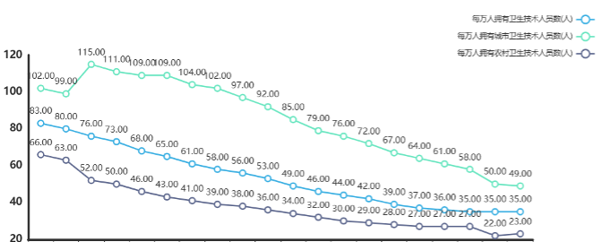

|           | 25% quantile | Median | 75% quantile | Maximum | Minimum |
|-----------|--------------|--------|--------------|---------|---------|
| Value     | 27.250       | 35.000 | 45.250       | 66.000  | 22.000  |

- Trend change: Data show that the number of rural health technicians has increased year by year, from 23 in 2003 to 52 in 2022.
Volatility: The number of rural health technicians is relatively concentrated and stable, indicating that the health expenditure of rural residents is generally more consistent.
- Mean and quantile: The mean value is 35.000 and the median is 35.000, indicating that the number of rural health technicians is on the rise overall, but the volatility is relatively small.
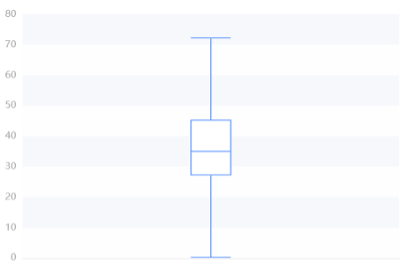

| Statistic    | 25% Quantile | Median | 75% Quantile | Maximum | Minimum |
|--------------|--------------|--------|--------------|---------|---------|
| Value        | 27.250       | 35.000 | 45.250       | 66.000  | 22.000  |

Overall, the number of health technicians is on the rise, with urban averages higher but more volatile, and rural averages relatively low and less volatile.
The data reflect the uneven distribution of health resources and services between urban and rural areas, which may be related to factors such as regional economic level, medical system, and population structure. Attention should be paid to the balanced development of urban and rural health resources. But the overall trend is upward.

### Total health costs between 2003 and 2023

The capital investment in healthcare has also increased greatly in our country, which further reflects the improvement of healthcare level.
Below is an overview description of the results of funding for different areas of healthcare and a box diagram of its various areas
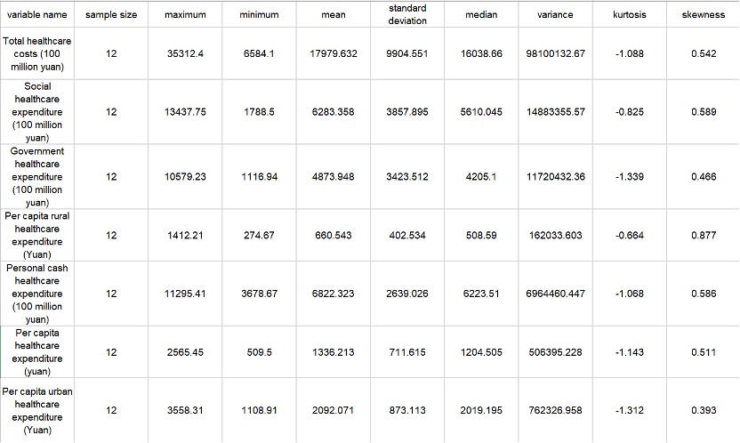
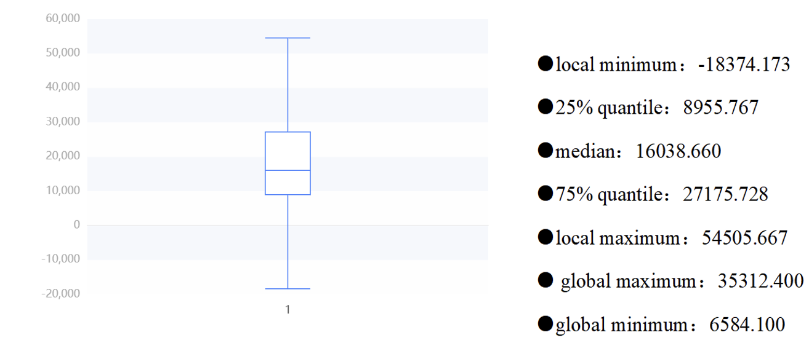

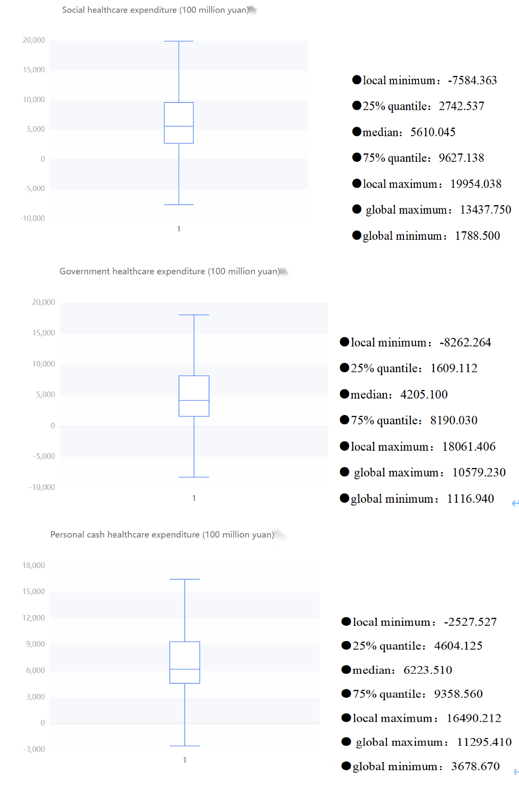
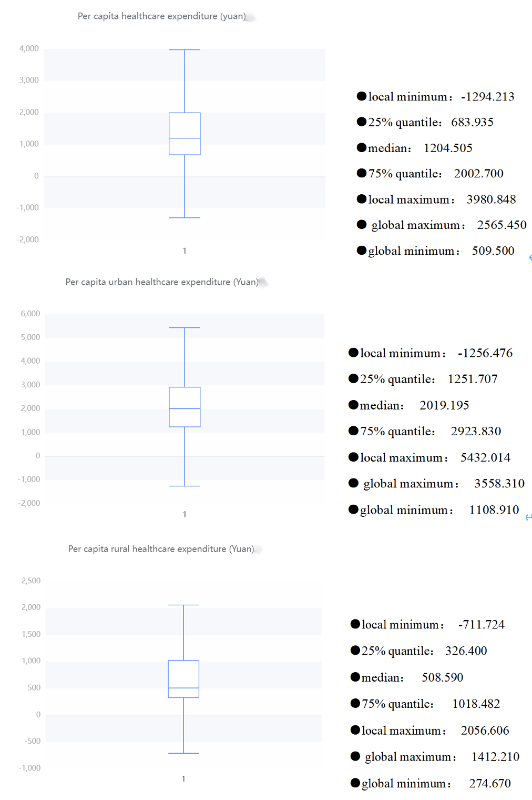

From these table, we can roughly know that the total healthcare expenditure is relatively high, and the government and social expenditure also occupy a considerable proportion. There is also a considerable difference between the government and social healthcare expenditure. The average government healthcare expenditure is 487.394.8 billion yuan, while the social healthcare expenditure is 628.335.8 billion yuan. The large standard deviation and high dispersion of the total healthcare cost reflect the differences in the management and resource allocation of the healthcare system in different places. It is necessary to pay attention to the balanced allocation and management efficiency of healthcare resources to ensure that all regions can obtain appropriate healthcare services and resource support.

Meanwhile, when looking at urban and rural health costs, there are some interesting findings. The average per capita health cost in urban areas (RMB 2,092.071) was significantly higher than that in rural areas (RMB 660.543), which may reflect that urban residents have easier access to more medical resources and services, and may also be related to the higher cost of living in cities.
In addition, the standard deviation of per capita health cost in cities is large (873.113 yuan), which means that there is a certain difference in health cost in cities. It may be that some urban residents spend more on health, while others spend less.
The standard deviation of per capita health expenditure in rural areas is small (402.534 yuan), indicating that the health expenditure of rural residents is relatively concentrated and stable on the whole.
Hence, there are significant differences in health costs between urban and rural areas, with higher average costs in cities, but also with large differences. These data may reflect the uneven distribution of rural and urban health resources and services.

Next, the scatterplot shows the results of the central trend analysis of the frequency analysis of total healthcare expenditure (100 million yuan), government healthcare expenditure (100 million yuan), social healthcare expenditure (100 million yuan), individual cash healthcare expenditure (100 million yuan), per capita healthcare expenditure (yuan), urban healthcare expenditure (yuan) and rural healthcare expenditure (yuan). The abscissa is from 2022 to 2003.

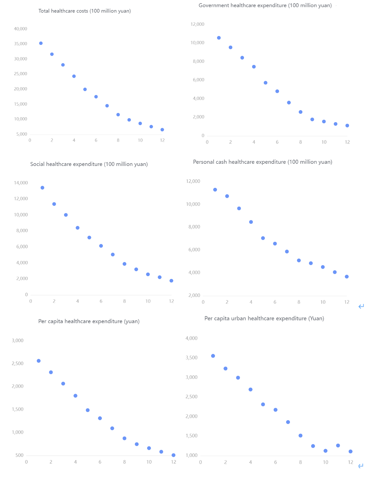
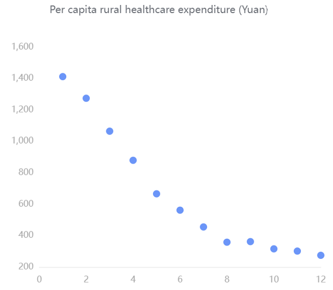
From these scatter diagrams, we can see that with the increase of the years, the funding for various aspects of healthcare is constantly increasing rapidly. The total cost of health care ranges from about 6,000 to 36,000. Government spending on healthcare ranges from about 1,800 to 10,800. Social healthcare expenditures ranged from about 2,200 to 13,500. Personal out-of-pocket healthcare expenditures ranged from about 4,000 to 11,500. Per capita healthcare expenditure ranges from about 260 to 500. Per capita urban health expenditure ranges from about 1,100 to 3,600. Per capita spending on healthcare in rural areas ranges from about 250 to 1400. It reflects the country's increasing emphasis on healthcare.

## Main result of the statistical analysis

### Analysis on National Health Expenditures

Since a stronger and more democratic country may have more budget for their public medical system, we may investigate the relationship between the year, budget, and number of medical personnel.

We may first depict the relationship between the year and budget to verify whether the two variables are in positive proportion over the recent 20 years.

For dataset “National Health Expenditures”, we want to estimate how much confidence we can conclude the budget is in an increasing trend over the past 20 years. Since the data collected is not in normal distribution, and our focus is to depict their trend, thus, we shall use linear regression for analysis. The null hypothesis shall be “there’s no relationship between the two variables”. Hence, we need to find the p-value and coefficients of all dependent variables with respect to the “year” attribute through R(Appendix Linear Regression-1)

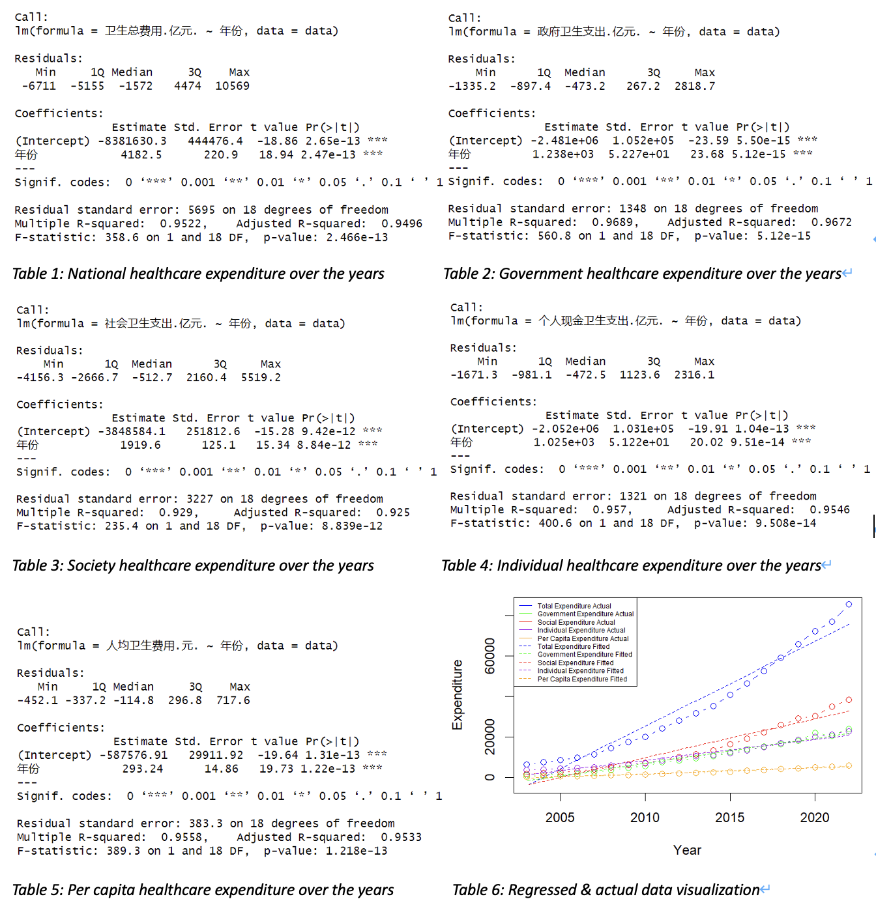

By inspecting all output tables, we may notice that $pValue≤8.839×10^{-12}<0.05$ and all coefficients for the year (“年份”) is positive. Therefore, we may have strong evidence to reject the null hypothesis and can conclude that all health expenditures are positive correlated with the year.
Consequently, we may conclude that China’s government alongside with its citizens are getting wealthier and have increased its investments in the health of citizens over the past 20 years.

For National health expenditure, its average increment rate over the past 20 years may imply the degree of the government attaches to people’s health.

$$
Average\ increment\ rate =\sum^{20}_{n=1}\frac{Val_{n+1}-Val_n}{Val_n}
$$

By using this formula, we may get the average increment rate of the national health expenditure between years is 14.51581% (Appendix Linear Regression-2).
Therefore, in average, the health budget for each year shall be 14.5% higher comparing to the last year, which may indicate the fast progressing of China’s economy over the past 20 years, with better medical conditions and spare money, people are more aware of the importance to get better healthcare.

As we have confirmed that the national health expenditure keeps increasing over the past 20 years, the number of medical personnel per ten thousand people is another important measure of a country’s robustness of its medical system. Since big medical system needs huge amount of money, manpower, advanced equipment to support, it may reflect the degree of development of a country. Obviously, by observation, these data are all increasing by years, but whether the progression in rural area are in the same level with the urban area. By using the same strategy of the average increment rate, we may depict the increment trend of urban area and rural area by adding "每万人拥有城市卫生技术人员数.人.", "每万人拥有城市执业.助理.医师数.人.", "每万人拥有城市注册护士数.人." up for total medical personnel in urban area, and summing "每万人拥有农村卫生技术人员数.人.", "每万人拥有农村执业.助理.医师数.人.", "每万人拥有农村注册护士数.人." up for total medical personnel in rural area.(Appendix Linear Regression-3)

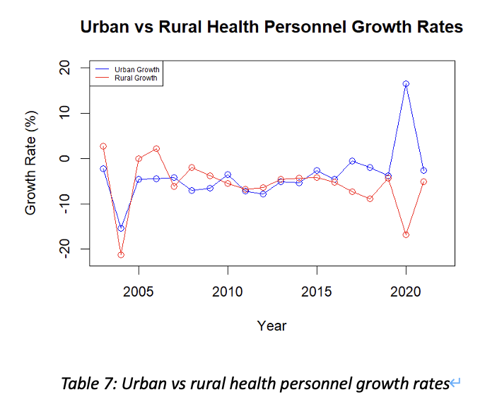

Therefore, we may notice that the total increment rate per year in a city is not always equivalent to that rate in a county. This can be influenced by emergencies and various issues. For example, the corona virus pandemic in 2020, since the urban area needs more doctors than rural area, medical personnel in rural may became personnel in a city. However, the overall increase of the number of medical personnel per ten thousand people is much slower than the increment in healthcare budget. Which may indicate that China’s progression in cultivating medical personnel is not in a very fast speed comparing to other investments.

### Analysis on Neonatal Mortality Rate

The dataset represents the neonatal mortality rate in China, spanning two decades. The mortality rate has been observed annually, allowing for a comprehensive analysis of trends over time.
Based on the dataset, We also conducted time series analysis on data *Infant mortality rate (‰)*,*Under-5 mortality rate (‰)*,*Maternal mortality rate (1/100,000)*, etc. The results will be shown later.

#### Methodology
An ARIMA model was utilized to forecast the neonatal mortality rate, based on historical data. The dataset was divided into a training set, encompassing the initial 15 years, and a test set, consisting of the last 5 years. The model's performance was assessed using several statistical metrics on both sets.

#### Forecast Accuracy

- The Mean Error (ME) indicated a slight overestimation in both the training (0.1438724) and test sets (0.1800000).
- The Root Mean Squared Error (RMSE) showed good predictive accuracy with lower values on the test set (0.3704052) compared to the training set (0.4394969).
- Mean Absolute Error (MAE) was marginally lower in the test set (0.3000000) than in the training set (0.3212009), suggesting consistency in predictive performance.

| Dataset       | ME        | RMSE     | MAE      | MPE     | MAPE    | MASE    |
|---------------|-----------|----------|----------|---------|---------|---------|
| Training set  | 0.1438724 | 0.4394969| 0.3212009| 1.414751| 3.622201| 0.3326045|
| Test set      | 0.1800000 | 0.3704052| 0.3000000| 6.018956| 9.259982| 0.3106509|

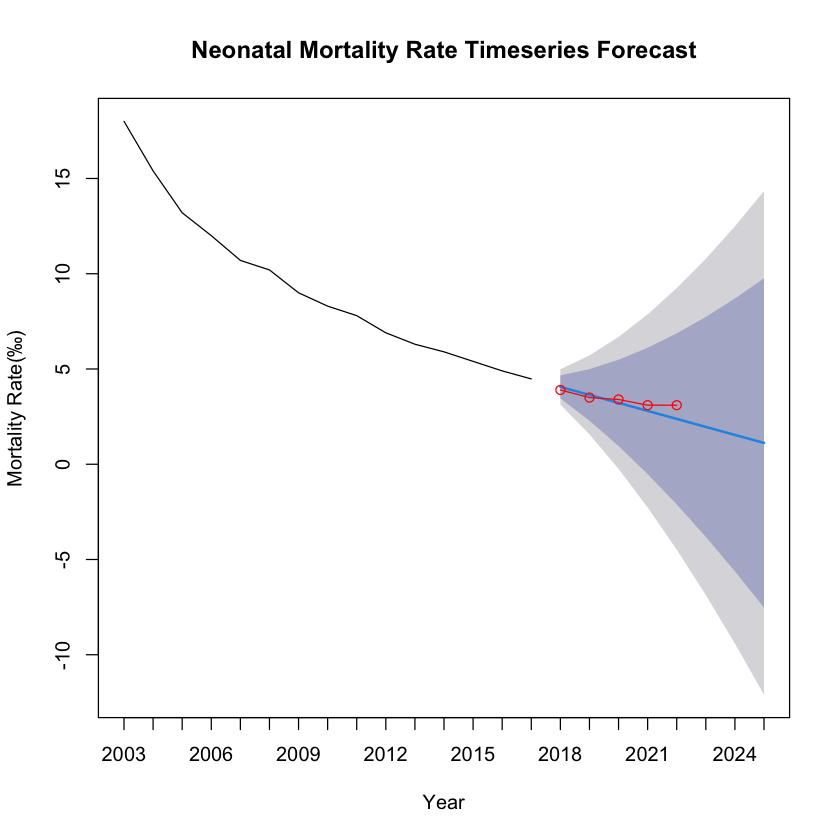

#### Error Analysis

- The Mean Percentage Error (MPE) and Mean Absolute Percentage Error (MAPE) were higher for the test set, with MPE significantly increasing to 6.018956, which may suggest model overfitting or changes in trends not captured by the historical data.
- Mean Absolute Scaled Error (MASE) below 1 for both sets indicates better performance than a naive benchmark model.

The ARIMA model demonstrates a satisfactory predictive capability for China's neonatal mortality rate, albeit with a tendency to overestimate. The test set's performance, particularly with lower RMSE and MAE, suggests the model has generalizability to unseen data.

#### Under-5 mortality rate (‰) Timeseries Forecast

| Dataset       | ME        | RMSE     | MAE      | MPE      | MAPE    | MASE    |
|---------------|-----------|----------|----------|----------|---------|---------|
| Training set  | 0.2474867 | 1.26505  | 0.9542962| 1.046281 | 6.279416| 0.6170969|
| Test set      | 1.9200000 | 2.20159  | 1.9200000| 26.708357| 26.708357| 1.2415704|

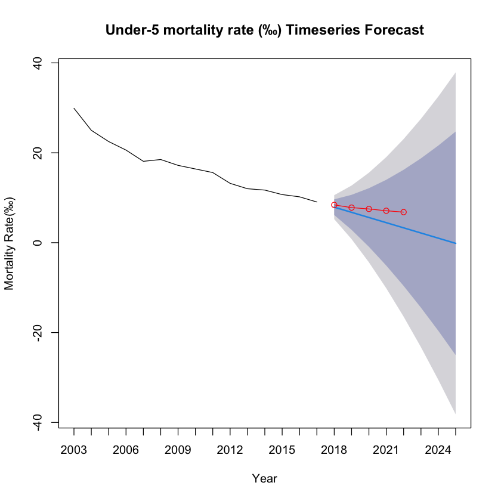

#### Maternal mortality rate (1/100,000) Timeseries Forecast

| Dataset       | ME        | RMSE     | MAE      | MPE     | MAPE    | MASE    |
|---------------|-----------|----------|----------|---------|---------|---------|
| Training set  | 0.3800723 | 1.638860 | 1.2644701| 1.868272| 4.274092| 0.5584411|
| Test set      | 0.2692575 | 0.493176 | 0.4013565| 1.722898| 2.444750| 0.1772553|

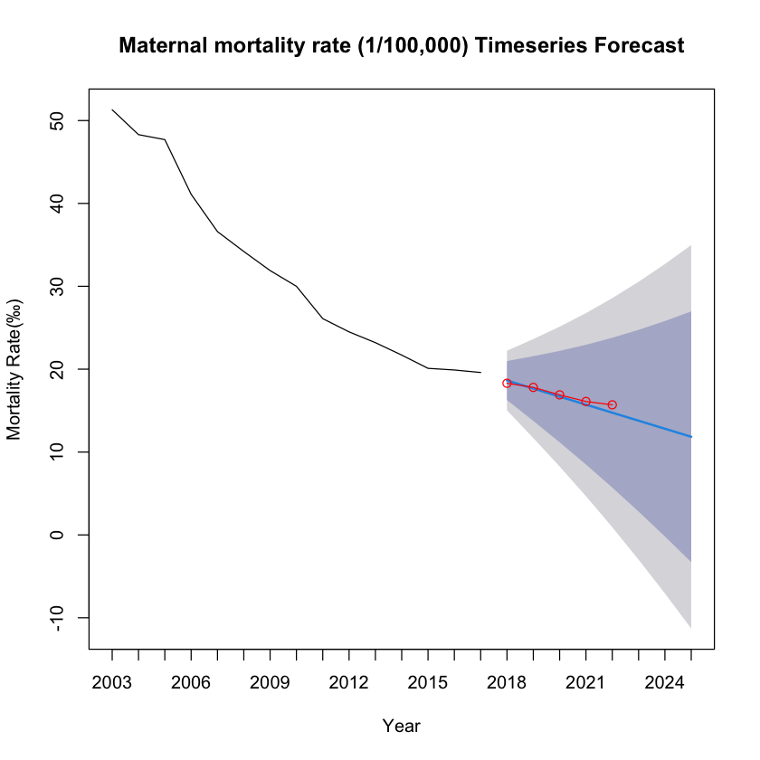

## Discussion and conclusion

After in-depth analysis of data such as medical expenditure, number of health workers, and child mortality, we can find that each data shows a positive high-level development trend. For example, as time goes by, investment in medical and health care continues to increase rapidly, while child mortality has significantly decreased. By collecting and testing these real data, we can draw the conclusion that our country has made significant progress in the medical and health field in the past 20-30 years. This conclusion strongly proves that our country has made significant progress during this period of time.

## References

- National Bureau of Statistics of China. (2023). Data on mortality rates of children under 5 years and maternal mortality in domestic testing regions from 2003 to 2022. Retrieved from <https://data.stats.gov.cn/>

- National Bureau of Statistics of China. (2023). Data on total health expenditures from 2003 to 2022 in China. Retrieved from <https://data.stats.gov.cn/>

- National Bureau of Statistics of China. (2023). Data on the number of health technicians per 10,000 population from 2003 to 2022 in China. Retrieved from <https://data.stats.gov.cn/>

## Appendix (R code)

### Linear Regression

#### Linear Regression-1

```r
data <- read.csv(file.choose(), header = TRUE)
# Convert '年份' (Year) to a numeric type if it's not already
data$年份 <- as.numeric(as.character(data$年份))
# Linear regression for each dependent variable against the year ('年份')
model1 <- lm(卫生总费用.亿元. ~ 年份, data=data)
summary(model1)
model2 <- lm(政府卫生支出.亿元. ~ 年份, data=data)
summary(model2)
model3 <- lm(社会卫生支出.亿元. ~ 年份, data=data)
summary(model3)
model4 <- lm(个人现金卫生支出.亿元. ~ 年份, data=data)
summary(model4)
model5 <- lm(人均卫生费用.元. ~ 年份, data=data)
summary(model5)
# Calculate fitted values for each model
fitted1 <- predict(model1)
fitted2 <- predict(model2)
fitted3 <- predict(model3)
fitted4 <- predict(model4)
fitted5 <- predict(model5)
# Set up the plot
plot(data$年份, data$卫生总费用.亿元., type="b", col="blue", ylim=c(min(data$卫生总费用.亿元., data$政府卫生支出.亿元., data$社会卫生支出.亿元., data$个人现金卫生支出.亿元., data$人均卫生费用.元., fitted1, fitted2, fitted3, fitted4, fitted5), max(data$卫生总费用.亿元., data$政府卫生支出.亿元., data$社会卫生支出.亿元., data$个人现金卫生支出.亿元., data$人均卫生费用.元., fitted1, fitted2, fitted3, fitted4, fitted5)), xlab="Year", ylab="Expenditure")
# Add actual data and fitted lines for other variables
points(data$年份, data$政府卫生支出.亿元., type="b", col="green")
points(data$年份, data$社会卫生支出.亿元., type="b", col="red")
points(data$年份, data$个人现金卫生支出.亿元., type="b", col="purple")
points(data$年份, data$人均卫生费用.元., type="b", col="orange")
lines(data$年份, fitted1, col="blue", lty=2)
lines(data$年份, fitted2, col="green", lty=2)
lines(data$年份, fitted3, col="red", lty=2)
lines(data$年份, fitted4, col="purple", lty=2)
lines(data$年份, fitted5, col="orange", lty=2)
legend("topleft", legend=c("Total Expenditure Actual", "Government Expenditure Actual", "Social Expenditure Actual", "Individual Expenditure Actual", "Per Capita Expenditure Actual", "Total Expenditure Fitted", "Government Expenditure Fitted", "Social Expenditure Fitted", "Individual Expenditure Fitted", "Per Capita Expenditure Fitted"), col=c("blue", "green", "red", "purple", "orange", "blue", "green", "red", "purple", "orange"), lty=c(1, 1, 1, 1, 1, 2, 2, 2, 2, 2), cex=0.5)
```

#### Linear Regression-2

```r
data <- data[order(data$年份),]
differences <- diff(data$卫生总费用.亿元.)
percentage_changes <- differences / head(data$卫生总费用.亿元., -1) * 100
average_increment <- mean(percentage_changes)
average_increment
```

#### Linear Regression-3

```r
data <- read.csv(file.choose(), header = TRUE)
data$Urban_Sum <- rowSums(data[, c("每万人拥有城市卫生技术人员数.人.", "每万人拥有城市执业.助理.医师数.人.", "每万人拥有城市注册护士数.人.")], na.rm = TRUE)
data$Rural_Sum <- rowSums(data[, c("每万人拥有农村卫生技术人员数.人.", "每万人拥有农村执业.助理.医师数.人.", "每万人拥有农村注册护士数.人.")], na.rm = TRUE)

urban_growth <- c(NA, diff(data$Urban_Sum) / data$Urban_Sum[-nrow(data)] * 100)
rural_growth <- c(NA, diff(data$Rural_Sum) / data$Rural_Sum[-nrow(data)] * 100)
data$Urban_Growth <- urban_growth
data$Rural_Growth <- rural_growth

plot(data$年份, data$Urban_Growth, type = "o", col = "blue", xlab = "Year", ylab = "Growth Rate (%)", main = "Urban vs Rural Health Personnel Growth Rates", ylim = c(-22, 20))
lines(data$年份, data$Rural_Growth, type = "o", col = "red")
legend("topleft", legend = c("Urban Growth", "Rural Growth"), col = c("blue", "red"), lty = 1, cex = 0.5)
```

### Time Series for Neonatal Mortality Rate

```r
library(forecast)
library(ggplot2)
library(dplyr)
# 读取数据
data <- read.csv(file.choose(), header = TRUE)
# 提取年份作为列名
years <- colnames(data)[-1] # 第一列之外的所有列名
# 选择特定的指标进行分析
mortality_rate <- as.numeric(data[data$指标 == "新生儿死亡率(‰)", -1])
# 如果数据是降序的，反转它以使其升序
mortality_rate <- rev(mortality_rate)
# 设置时间序列的开始年份为2003
time_series <- ts(mortality_rate, start = c(2003), frequency = 1)
# 定义训练集和测试集的大小
n <- length(time_series)
n_test <- 5 # 测试集大小
n_train <- n - n_test # 训练集大小
# 拆分数据为训练集和测试集
train_set <- time_series[1:n_train]
test_set <- time_series[(n_train + 1):n]
# 使用训练集拟合ARIMA模型
model <- auto.arima(train_set)
# 在测试集上进行预测
forecast <- forecast(model, h = n_test + 3)
# 绘制预测结果
plot(forecast,
  xlab = "Year", ylab = "Mortality Rate(‰)",
  main = "Neonatal Mortality Rate Timeseries Forecast",
  xaxt = "n"
)
x_range <- 2003:2025 # 从2003年到2022年
axis(1, at = seq_along(x_range), labels = x_range)
# 绘制测试集的实际值
start_year_test_set <- n_train + 1
# 绘制测试集的实际值
lines(
  x = seq(start_year_test_set, by = 1, length.out = n_test),
  y = test_set,
  col = "red", type = "o"
)
# 计算预测的准确性
accuracy(forecast, test_set)
```

### Time Series for Under-5 mortality rate (‰)

```r
# 读取数据
data <- read.csv(file.choose(), header = TRUE)
# 提取年份作为列名
years <- colnames(data)[-1] # 第一列之外的所有列名
# 选择特定的指标进行分析
mortality_rate <- as.numeric(data[data$指标 == "5岁以下儿童死亡率(‰)", -1])
# 如果数据是降序的，反转它以使其升序
mortality_rate <- rev(mortality_rate)
# 设置时间序列的开始年份为2003
time_series <- ts(mortality_rate, start = c(2003), frequency = 1)
# 定义训练集和测试集的大小
n <- length(time_series)
n_test <- 5 # 测试集大小
n_train <- n - n_test # 训练集大小
# 拆分数据为训练集和测试集
train_set <- time_series[1:n_train]
test_set <- time_series[(n_train + 1):n]
# 使用训练集拟合ARIMA模型
model <- auto.arima(train_set)
# 在测试集上进行预测
forecast <- forecast(model, h = n_test + 3)
# 绘制预测结果
plot(forecast,
  xlab = "Year", ylab = "Mortality Rate(‰)",
  main = "Under-5 mortality rate (‰) Timeseries Forecast",
  xaxt = "n"
)
x_range <- 2003:2025 # 从2003年到2022年
axis(1, at = seq_along(x_range), labels = x_range)
# 绘制测试集的实际值
start_year_test_set <- n_train + 1
# 绘制测试集的实际值
lines(
  x = seq(start_year_test_set, by = 1, length.out = n_test),
  y = test_set,
  col = "red", type = "o"
)
# 计算预测的准确性
accuracy(forecast, test_set)
```

### Time Series for Maternal mortality rate

```r
# 读取数据
data <- read.csv(file.choose(), header = TRUE)
# 提取年份作为列名
years <- colnames(data)[-1] # 第一列之外的所有列名
# 选择特定的指标进行分析
mortality_rate <- as.numeric(data[data$指标 == "孕产妇死亡率(1/10万)", -1])
# 如果数据是降序的，反转它以使其升序
mortality_rate <- rev(mortality_rate)
# 设置时间序列的开始年份为2003
time_series <- ts(mortality_rate, start = c(2003), frequency = 1)
# 定义训练集和测试集的大小
n <- length(time_series)
n_test <- 5 # 测试集大小
n_train <- n - n_test # 训练集大小
# 拆分数据为训练集和测试集
train_set <- time_series[1:n_train]
test_set <- time_series[(n_train + 1):n]
# 使用训练集拟合ARIMA模型
model <- auto.arima(train_set)
# 在测试集上进行预测
forecast <- forecast(model, h = n_test + 3)
# 绘制预测结果
plot(forecast,
  xlab = "Year", ylab = "Mortality Rate(‰)",
  main = "Maternal mortality rate (1/100,000) Timeseries Forecast",
  xaxt = "n"
)
x_range <- 2003:2025 # 从2003年到2022年
axis(1, at = seq_along(x_range), labels = x_range)
# 绘制测试集的实际值
start_year_test_set <- n_train + 1
# 绘制测试集的实际值
lines(
  x = seq(start_year_test_set, by = 1, length.out = n_test),
  y = test_set,
  col = "red", type = "o"
)
# 计算预测的准确性
accuracy(forecast, test_set)
```

| English Term                                      | Chinese Term              |
|---------------------------------------------------|---------------------------|
| Neonatal mortality rate (‰)                       | 新生儿死亡率(‰)           |
| Urban neonatal mortality rate (‰)                 | 城市新生儿死亡率(‰)       |
| Rural neonatal mortality rate (‰)                 | 农村新生儿死亡率(‰)       |
| Infant mortality rate (‰)                         | 婴儿死亡率(‰)             |
| Urban infant mortality rate (‰)                   | 城市婴儿死亡率(‰)         |
| Rural infant mortality rate (‰)                   | 农村婴儿死亡率(‰)         |
| Under-5 mortality rate (‰)                        | 5岁以下儿童死亡率(‰)      |
| Urban under-5 mortality rate (‰)                  | 城市5岁以下儿童死亡率(‰)  |
| Mortality rate of children under 5 years of age in rural areas (‰) | 农村5岁以下儿童死亡率(‰)  |
| Maternal mortality rate (1/100,000)               | 孕产妇死亡率(1/10万)      |
| Urban maternal mortality rate (1/100,000)         | 城市孕产妇死亡率(1/10万)  |
| Rural maternal mortality rate (1/100,000)         | 农村孕产妇死亡率(1/10万)  |
